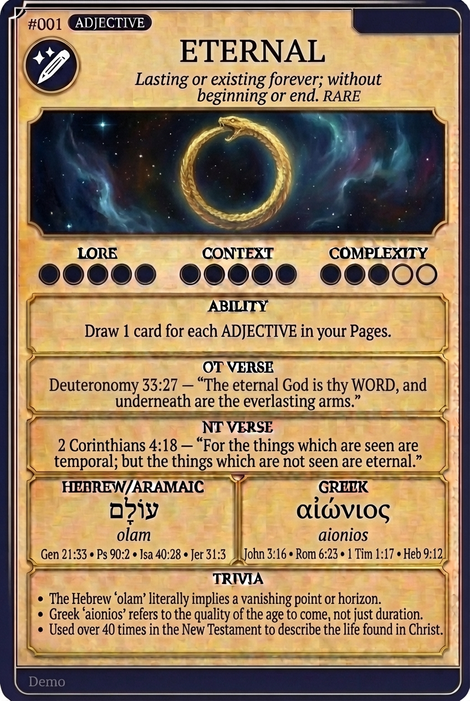

# Hypertext — ETERNAL

## Word
**ETERNAL** — Lasting or existing forever; without beginning or end.

## Old Testament
> Deuteronomy 33:27 — "The eternal God is thy refuge, and underneath are the everlasting arms."

## New Testament
> 2 Corinthians 4:18 — "For the things which are seen are temporal; but the things which are not seen are eternal."

## Trivia
- The Hebrew 'olam' literally implies a vanishing point or horizon.
- Greek 'aionios' refers to the quality of the age to come, not just duration.
- Used over 40 times in the New Testament to describe the life found in Christ.

