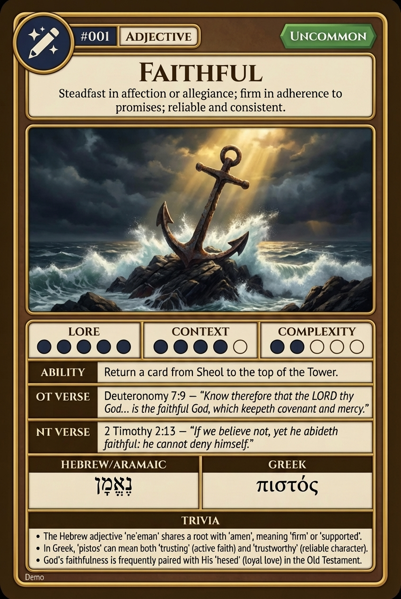

# Hypertext — FAITHFUL

## Word
**FAITHFUL** — Steadfast in affection or allegiance; firm in adherence to promises; reliable and consistent.

## Old Testament
> Deuteronomy 7:9 — "Know therefore that the LORD thy God... is the faithful God, which keepeth covenant and mercy."

## New Testament
> 2 Timothy 2:13 — "If we believe not, yet he abideth faithful: he cannot deny himself."

## Trivia
- The Hebrew adjective 'ne'eman' shares a root with 'amen', meaning 'firm' or 'supported'.
- In Greek, 'pistos' can mean both 'trusting' (active faith) and 'trustworthy' (reliable character).
- God's faithfulness is frequently paired with His 'hesed' (loyal love) in the Old Testament.

