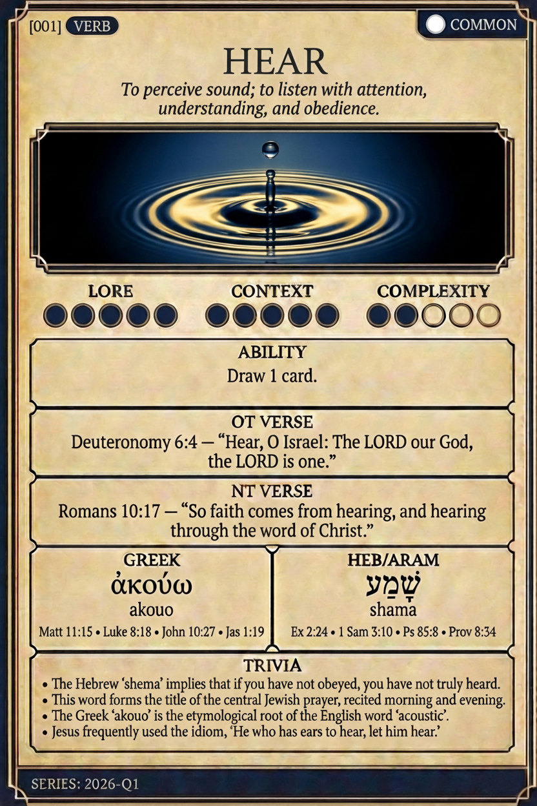

# Hypertext — HEAR

## Word
**HEAR** — To perceive sound; to listen with attention, understanding, and obedience.

## Old Testament
> Deuteronomy 6:4 — “Hear, O Israel: The LORD our God, the LORD is one.”

## New Testament
> Romans 10:17 — “So faith comes from hearing, and hearing through the word of Christ.”

## Trivia
- The Hebrew 'shema' implies that if you have not obeyed, you have not truly heard.
- This word forms the title of the central Jewish prayer, recited morning and evening.
- The Greek 'akouo' is the etymological root of the English word 'acoustic'.
- Jesus frequently used the idiom, 'He who has ears to hear, let him hear.'

