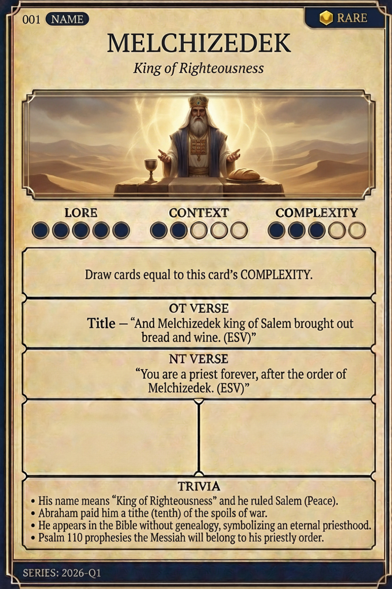

# Hypertext — MELCHIZEDEK

## Word
**MELCHIZEDEK** — King of Righteousness

## Old Testament
> Genesis 14:18 — “And Melchizedek king of Salem brought out bread and wine. (ESV)”

## New Testament
> Hebrews 7:17 — “You are a priest forever, after the order of Melchizedek. (ESV)”

## Trivia
- His name means 'King of Righteousness' and he ruled Salem (Peace).
- Abraham paid him a tithe (tenth) of the spoils of war.
- He appears in the Bible without genealogy, symbolizing an eternal priesthood.
- Psalm 110 prophesies the Messiah will belong to his priestly order.

