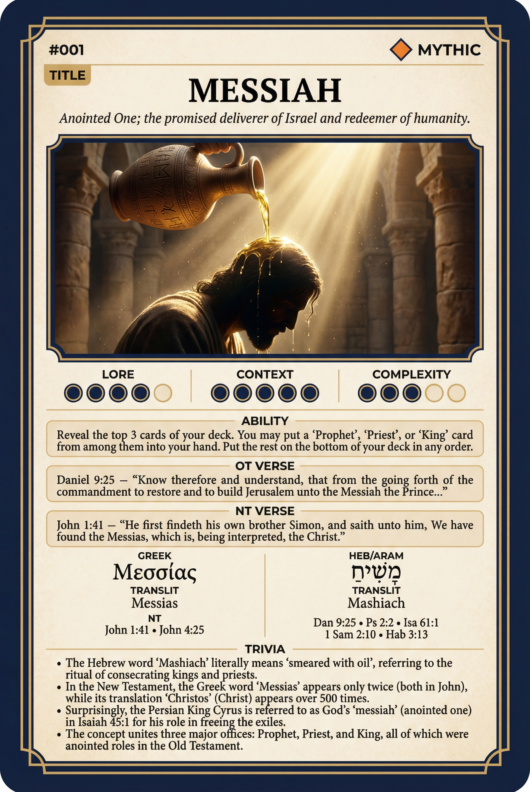

# Hypertext — MESSIAH

## Word
**MESSIAH** — Anointed One; the promised deliverer of Israel and redeemer of humanity.

## Old Testament
> Daniel 9:25 — “Know therefore and understand, that from the going forth of the commandment to restore and to build Jerusalem unto the Messiah the Prince...”

## New Testament
> John 1:41 — “He first findeth his own brother Simon, and saith unto him, We have found the Messias, which is, being interpreted, the Christ.”

## Trivia
- The Hebrew word 'Mashiach' literally means 'smeared with oil', referring to the ritual of consecrating kings and priests.
- In the New Testament, the Greek word 'Messias' appears only twice (both in John), while its translation 'Christos' (Christ) appears over 500 times.
- Surprisingly, the Persian King Cyrus is referred to as God's 'messiah' (anointed one) in Isaiah 45:1 for his role in freeing the exiles.
- The concept unites three major offices: Prophet, Priest, and King, all of which were anointed roles in the Old Testament.

