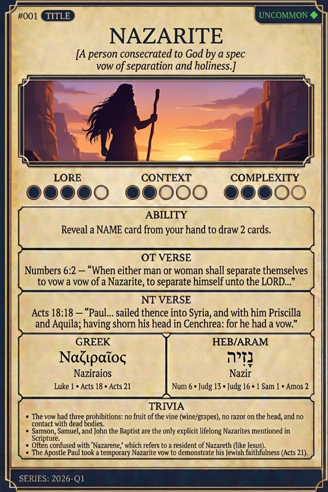

# Hypertext — NAZARITE

## Word
**NAZARITE** — A person consecrated to God by a special vow of separation and holiness.

## Old Testament
> Numbers 6:2 — “When either man or woman shall separate themselves to vow a vow of a Nazarite, to separate himself unto the LORD...”

## New Testament
> Acts 18:18 — “Paul... sailed thence into Syria, and with him Priscilla and Aquila; having shorn his head in Cenchrea: for he had a vow.”

## Trivia
- The vow had three prohibitions: no fruit of the vine (wine/grapes), no razor on the head, and no contact with dead bodies.
- Samson, Samuel, and John the Baptist are the only explicit lifelong Nazarites mentioned in Scripture.
- Often confused with 'Nazarene,' which refers to a resident of Nazareth (like Jesus).
- The Apostle Paul took a temporary Nazarite vow to demonstrate his Jewish faithfulness (Acts 21).

