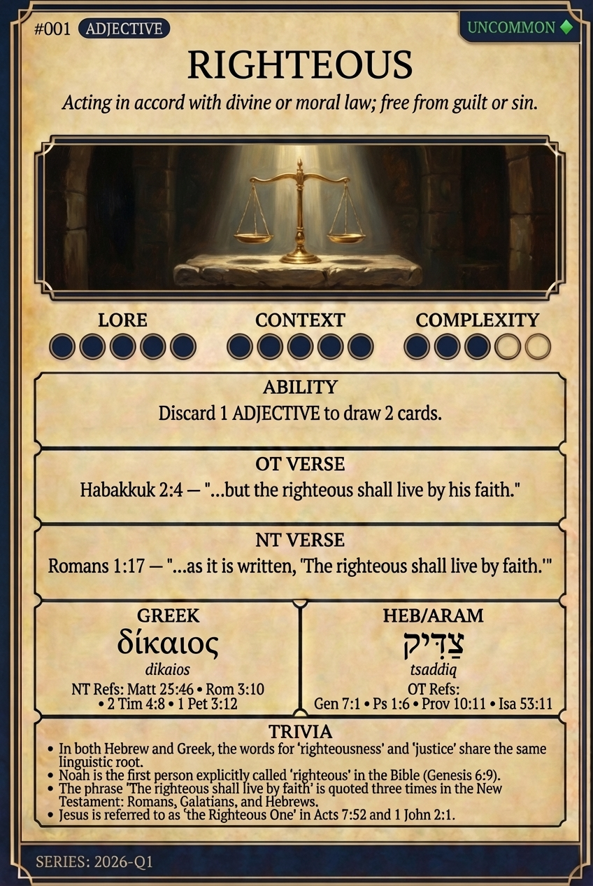

# Hypertext — RIGHTEOUS

## Word
**RIGHTEOUS** — Morally right or justifiable; acting in accord with divine or moral law; free from guilt or sin.

## Old Testament
> Genesis 7:1 — "For thee have I seen righteous before me in this generation."

## New Testament
> Romans 1:17 — "The just shall live by faith."

## Trivia
- First used in the Bible to describe Noah (Gen 6:9).
- The Hebrew root implies being straight or conforming to a standard.
- In the NT, righteousness is often described as a gift from God rather than earned.

