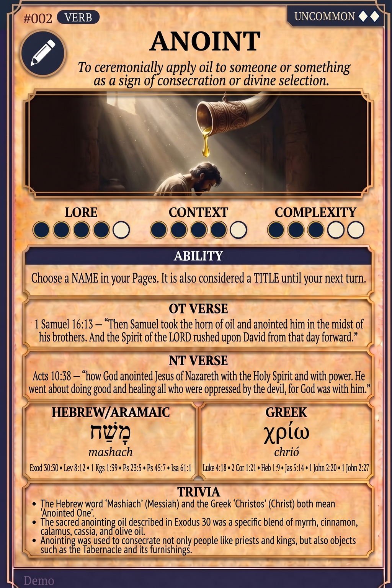

# Hypertext — ANOINT

## Word
**ANOINT** — To ceremonially apply oil to someone or something as a sign of consecration or divine selection.

## Old Testament
> 1 Samuel 16:13 — "Then Samuel took the horn of oil and anointed him in the midst of his brothers. And the Spirit of the LORD rushed upon David from that day forward."

## New Testament
> Acts 10:38 — "how God anointed Jesus of Nazareth with the Holy Spirit and with power. He went about doing good and healing all who were oppressed by the devil, for God was with him."

## Trivia
- The Hebrew word 'Mashiach' (Messiah) and the Greek 'Christos' (Christ) both mean 'Anointed One'.
- The sacred anointing oil described in Exodus 30 was a specific blend of myrrh, cinnamon, calamus, cassia, and olive oil.
- Anointing was used to consecrate not only people like priests and kings, but also objects such as the Tabernacle and its furnishings.

