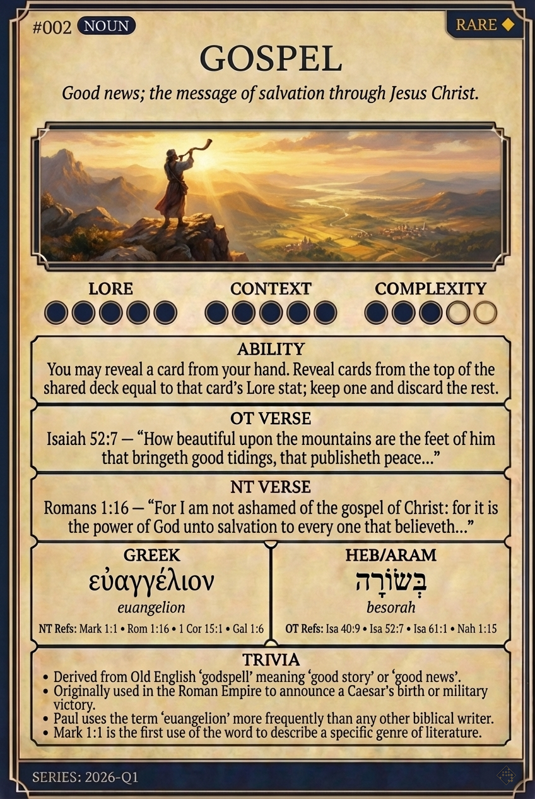

# Hypertext — GOSPEL

## Word
**GOSPEL** — Good news; the message of salvation through Jesus Christ.

## Old Testament
> Isaiah 52:7 — “How beautiful upon the mountains are the feet of him that bringeth good tidings, that publisheth peace...”

## New Testament
> Romans 1:16 — “For I am not ashamed of the gospel of Christ: for it is the power of God unto salvation to every one that believeth...”

## Trivia
- Derived from Old English 'godspell' meaning 'good story' or 'good news'.
- Originally used in the Roman Empire to announce a Caesar's birth or military victory.
- Paul uses the term 'euangelion' more frequently than any other biblical writer.
- Mark 1:1 is the first use of the word to describe a specific genre of literature.

