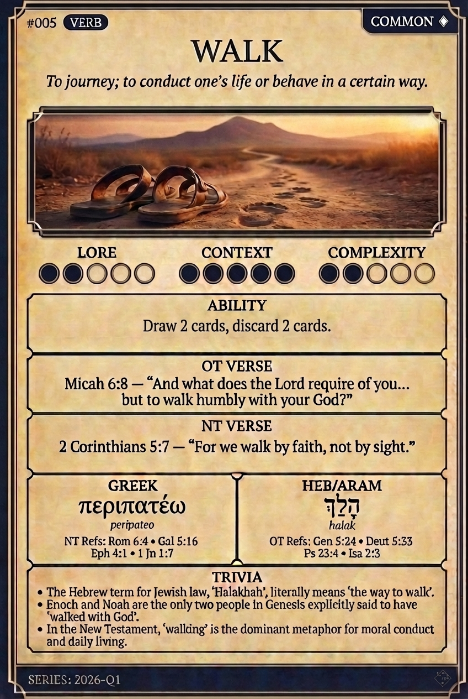

# Hypertext — WALK

## Word
**WALK** — To journey; to conduct one's life or behave in a certain way.

## Old Testament
> Micah 6:8 — “And what does the Lord require of you... but to walk humbly with your God?”

## New Testament
> 2 Corinthians 5:7 — “For we walk by faith, not by sight.”

## Trivia
- The Hebrew term for Jewish law, 'Halakhah', literally means 'the way to walk'.
- Enoch and Noah are the only two people in Genesis explicitly said to have 'walked with God'.
- In the New Testament, 'walking' is the dominant metaphor for moral conduct and daily living.

