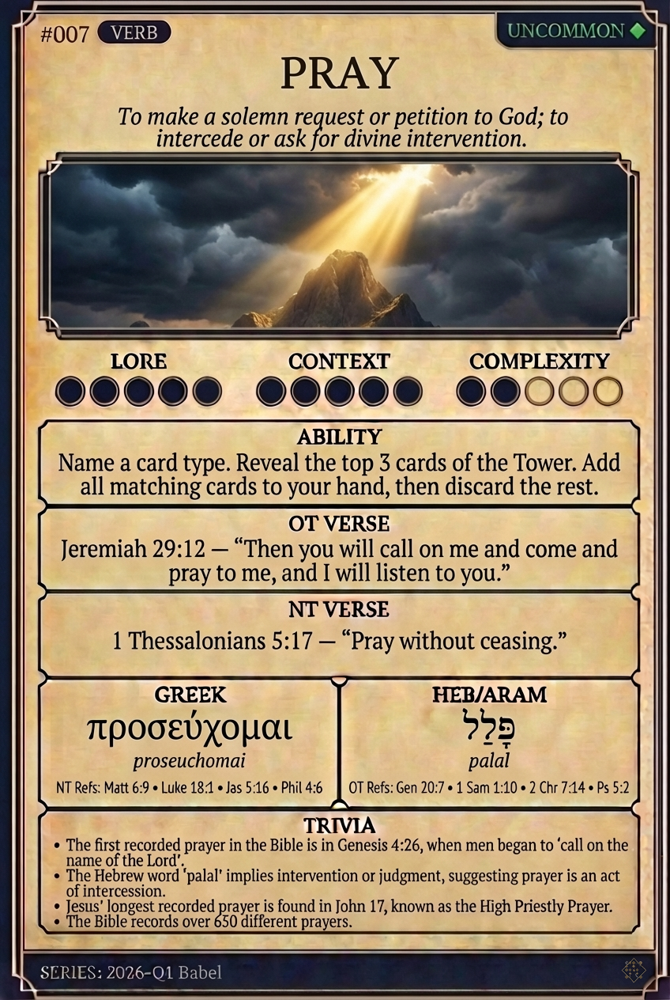

# Hypertext — PRAY

## Word
**PRAY** — To make a solemn request or petition to God; to intercede or ask for divine intervention.

## Old Testament
> Jeremiah 29:12 — “Then you will call on me and come and pray to me, and I will listen to you.”

## New Testament
> 1 Thessalonians 5:17 — “Pray without ceasing.”

## Trivia
- The first recorded prayer in the Bible is in Genesis 4:26, when men began to 'call on the name of the Lord'.
- The Hebrew word 'palal' implies intervention or judgment, suggesting prayer is an act of intercession.
- Jesus' longest recorded prayer is found in John 17, known as the High Priestly Prayer.
- The Bible records over 650 different prayers.

