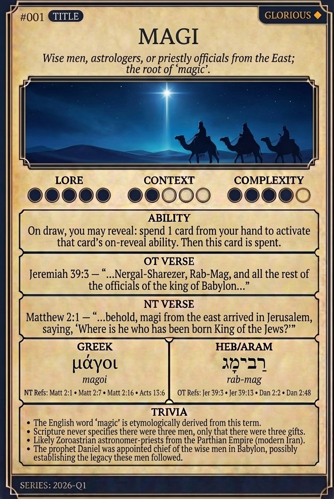

# Hypertext — MAGI

## Word
**MAGI** — Wise men, astrologers, or priestly officials from the East; the root of 'magic'.

## Old Testament
> Jeremiah 39:3 — “...Nergal-Sharezer, Rab-Mag, and all the rest of the officials of the king of Babylon...”

## New Testament
> Matthew 2:1 — “...behold, magi from the east arrived in Jerusalem, saying, 'Where is he who has been born King of the Jews?'”

## Trivia
- The English word 'magic' is etymologically derived from this term.
- Scripture never specifies there were three men, only that there were three gifts.
- Likely Zoroastrian astronomer-priests from the Parthian Empire (modern Iran).
- The prophet Daniel was appointed chief of the wise men in Babylon, possibly establishing the legacy these men followed.

