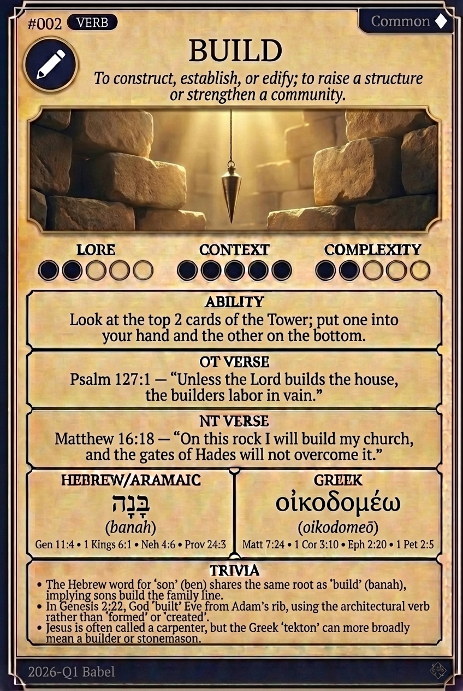

# Hypertext — BUILD

## Word
**BUILD** — To construct, establish, or edify; to raise a structure or strengthen a community.

## Old Testament
> Psalm 127:1 — "Unless the Lord builds the house, the builders labor in vain."

## New Testament
> Matthew 16:18 — "On this rock I will build my church, and the gates of Hades will not overcome it."

## Trivia
- The Hebrew word for 'son' (ben) shares the same root as 'build' (banah), implying sons build the family line.
- In Genesis 2:22, God 'built' Eve from Adam's rib, using the architectural verb rather than 'formed' or 'created'.
- Jesus is often called a carpenter, but the Greek 'tekton' can more broadly mean a builder or stonemason.

