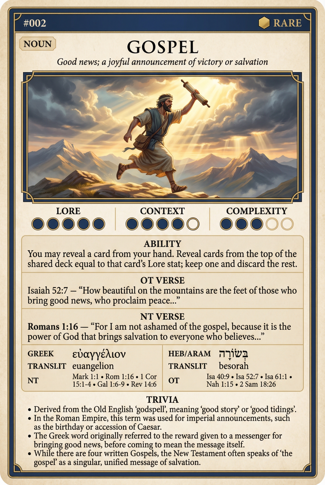

# Hypertext — GOSPEL

## Word
**GOSPEL** — Good news; a joyful announcement of victory or salvation.

## Old Testament
> Isaiah 52:7 — “How beautiful upon the mountains are the feet of him who brings good news, who publishes peace...”

## New Testament
> Romans 1:16 — “For I am not ashamed of the gospel, for it is the power of God for salvation to everyone who believes...”

## Trivia
- Derived from Old English 'godspell' (good story), a calque of the Greek 'euangelion'.
- In the Roman Empire, this term was used for imperial announcements, such as a military victory or the emperor's birthday.
- The 'Proto-Evangelium' (first gospel) is often identified as the promise in Genesis 3:15.
- Paul specifically defines the content of the gospel in 1 Corinthians 15 as Christ's death, burial, and resurrection.

