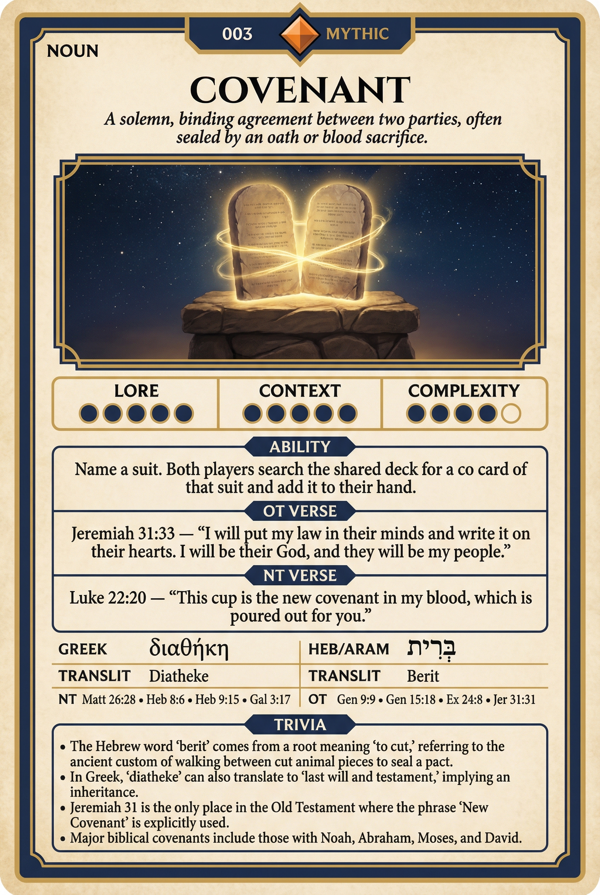

# Hypertext — COVENANT

## Word
**COVENANT** — A solemn, binding agreement or promise, often sealed in blood, establishing a relationship between two parties.

## Old Testament
> Jeremiah 31:31 — “I will make a new covenant with the house of Israel and with the house of Judah.”

## New Testament
> Matthew 26:28 — “For this is My blood of the new covenant, which is shed for many for the remission of sins.”

## Trivia
- The Hebrew phrase for making a covenant is literally 'to cut a covenant' (karat berit).
- Ancient covenants were often ratified by walking between the severed halves of sacrificed animals.
- The Ark of the Covenant contained the stone tablets, a jar of manna, and Aaron's rod.
- In the Septuagint, the Greek word 'diatheke' was chosen over 'syntheke' to emphasize God's initiative rather than a mutual contract.

