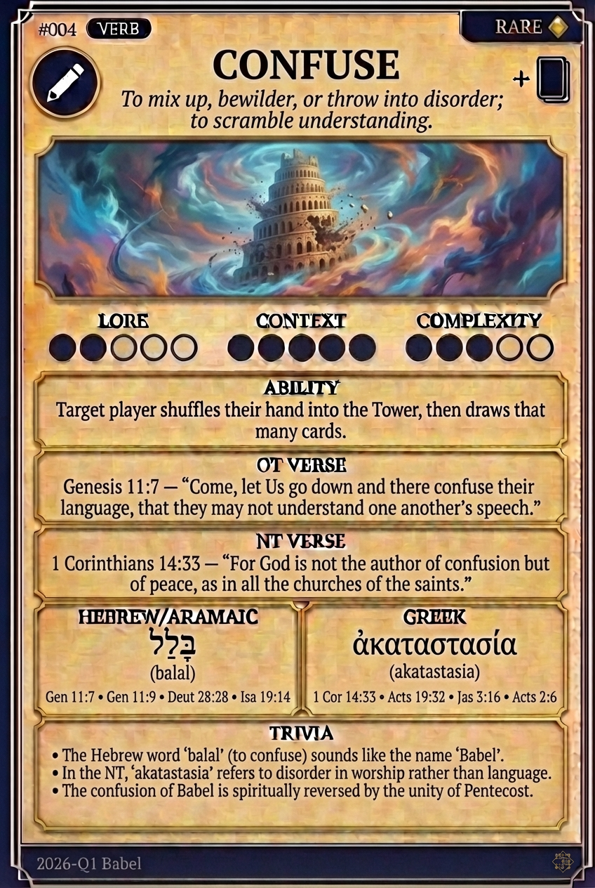

# Hypertext — CONFUSE

## Word
**CONFUSE** — To mix up, bewilder, or throw into disorder; to scramble understanding.

## Old Testament
> Genesis 11:7 — "Come, let Us go down and there confuse their language, that they may not understand one another’s speech."

## New Testament
> 1 Corinthians 14:33 — "For God is not the author of confusion but of peace, as in all the churches of the saints."

## Trivia
- The Hebrew word 'balal' (to confuse) sounds like the name 'Babel'.
- In the NT, 'akatastasia' refers to disorder in worship rather than language.
- The confusion of Babel is spiritually reversed by the unity of Pentecost.

