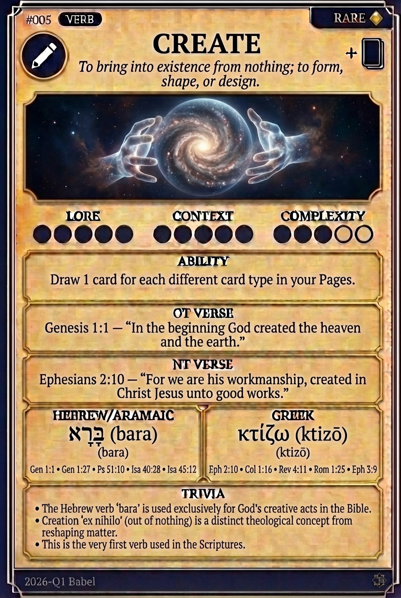

# Hypertext — CREATE

## Word
**CREATE** — To bring into existence from nothing; to form, shape, or design.

## Old Testament
> Genesis 1:1 — "In the beginning God created the heaven and the earth."

## New Testament
> Ephesians 2:10 — "For we are his workmanship, created in Christ Jesus unto good works."

## Trivia
- The Hebrew verb 'bara' is used exclusively for God's creative acts in the Bible.
- Creation 'ex nihilo' (out of nothing) is a distinct theological concept from reshaping matter.
- This is the very first verb used in the Scriptures.

