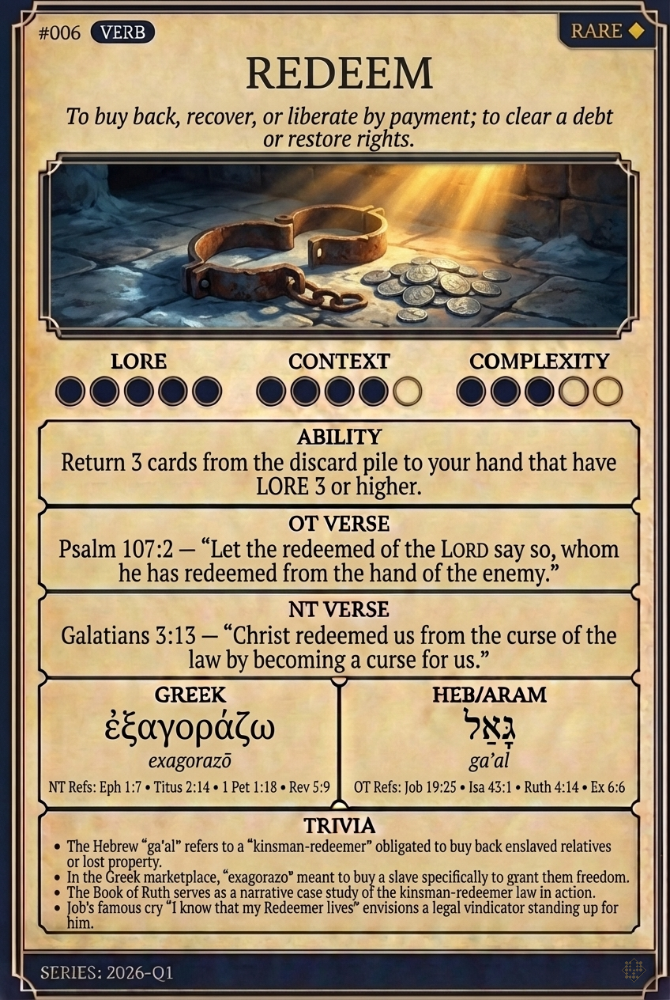

# Hypertext — REDEEM

## Word
**REDEEM** — To buy back, recover, or liberate by payment; to clear a debt or restore rights.

## Old Testament
> Psalm 107:2 — “Let the redeemed of the LORD say so, whom he has redeemed from the hand of the enemy.”

## New Testament
> Galatians 3:13 — “Christ redeemed us from the curse of the law by becoming a curse for us.”

## Trivia
- The Hebrew 'ga'al' refers to a 'kinsman-redeemer' obligated to buy back enslaved relatives or lost property.
- In the Greek marketplace, 'exagorazo' meant to buy a slave specifically to grant them freedom.
- The Book of Ruth serves as a narrative case study of the kinsman-redeemer law in action.
- Job's famous cry 'I know that my Redeemer lives' envisions a legal vindicator standing up for him.

