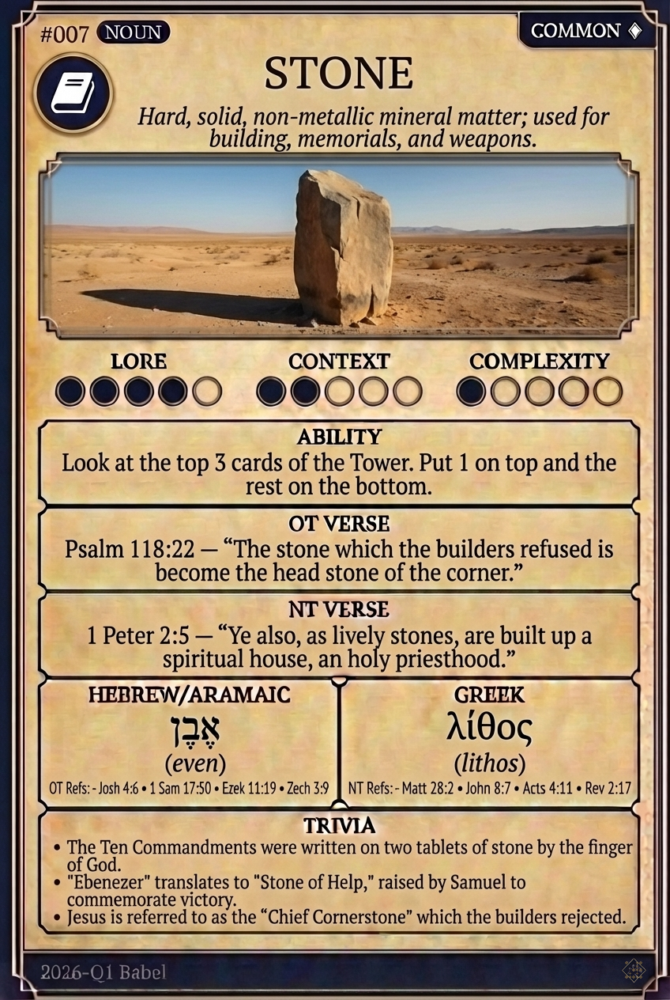

# Hypertext — STONE

## Word
**STONE** — Hard, solid, non-metallic mineral matter; used for building, memorials, and weapons.

## Old Testament
> Psalm 118:22 — "The stone which the builders refused is become the head stone of the corner."

## New Testament
> 1 Peter 2:5 — "Ye also, as lively stones, are built up a spiritual house, an holy priesthood."

## Trivia
- The Ten Commandments were written on two tablets of stone by the finger of God.
- "Ebenezer" translates to "Stone of Help," raised by Samuel to commemorate victory.
- Jesus is referred to as the "Chief Cornerstone" which the builders rejected.

