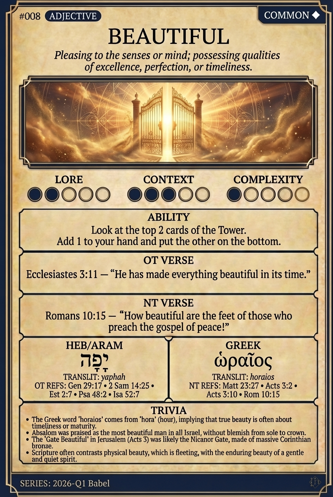

# Hypertext — BEAUTIFUL

## Word
**BEAUTIFUL** — Pleasing to the senses or mind; possessing qualities of excellence, perfection, or timeliness.

## Old Testament
> Ecclesiastes 3:11 — "He has made everything beautiful in its time."

## New Testament
> Romans 10:15 — "How beautiful are the feet of those who preach the gospel of peace!"

## Trivia
- The Greek word 'horaios' comes from 'hora' (hour), implying that true beauty is often about timeliness or maturity.
- Absalom was praised as the most beautiful man in all Israel, without blemish from sole to crown.
- The 'Gate Beautiful' in Jerusalem (Acts 3) was likely the Nicanor Gate, made of massive Corinthian bronze.
- Scripture often contrasts physical beauty, which is fleeting, with the enduring beauty of a gentle and quiet spirit.

