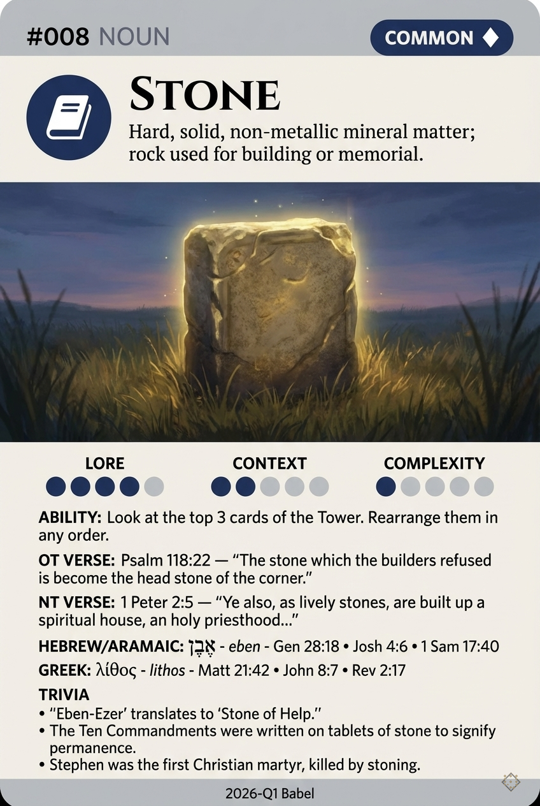

# Hypertext — STONE

## Word
**STONE** — Hard, solid, non-metallic mineral matter; rock used for building or memorial.

## Old Testament
> Psalm 118:22 — "The stone which the builders refused is become the head stone of the corner."

## New Testament
> 1 Peter 2:5 — "Ye also, as lively stones, are built up a spiritual house, an holy priesthood..."

## Trivia
- "Eben-Ezer" translates to "Stone of Help."
- The Ten Commandments were written on tablets of stone to signify permanence.
- Stephen was the first Christian martyr, killed by stoning.

