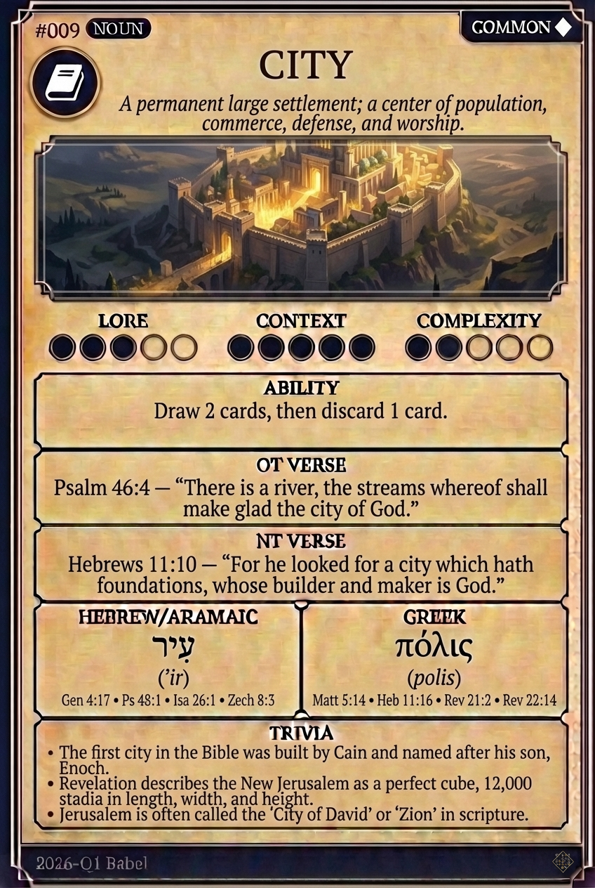

# Hypertext — CITY

## Word
**CITY** — A permanent large settlement; a center of population, commerce, defense, and worship.

## Old Testament
> Psalm 46:4 — "There is a river, the streams whereof shall make glad the city of God."

## New Testament
> Hebrews 11:10 — "For he looked for a city which hath foundations, whose builder and maker is God."

## Trivia
- The first city in the Bible was built by Cain and named after his son, Enoch.
- Revelation describes the New Jerusalem as a perfect cube, 12,000 stadia in length, width, and height.
- Jerusalem is often called the 'City of David' or 'Zion' in scripture.

