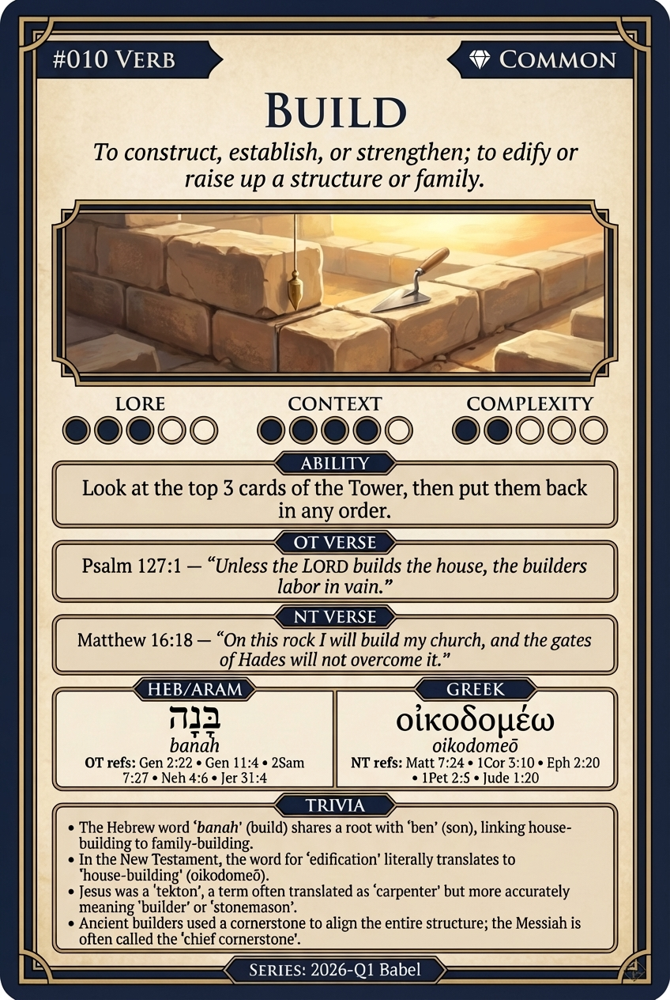

# Hypertext — BUILD

## Word
**BUILD** — To construct, establish, or strengthen by assembling parts; to edify.

## Old Testament
> Psalm 127:1 — "Unless the Lord builds the house, the builders labor in vain."

## New Testament
> Matthew 16:18 — "And I tell you that you are Peter, and on this rock I will build my church."

## Trivia
- The Hebrew word 'banah' (build) shares a root with 'ben' (son), implying children 'build' a family.
- In the New Testament, 'edify' translates 'oikodomeō', literally meaning 'house-building'.
- Jesus was a 'tekton', often translated 'carpenter' but more accurately a builder or stonemason.
- Believers are described as 'living stones' being built into a spiritual house (1 Peter 2:5).

