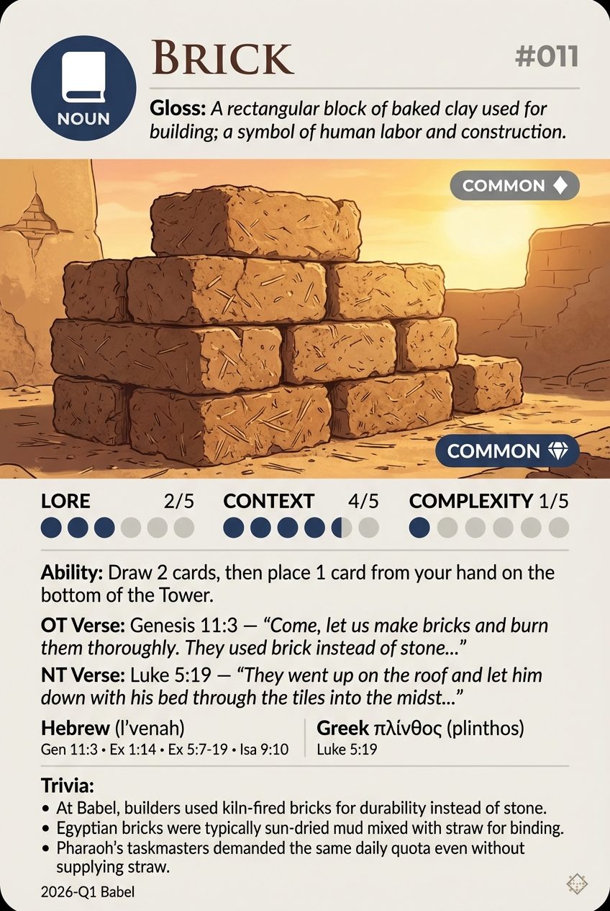

# Hypertext — BRICK

## Word
**BRICK** — A rectangular block of baked clay used for building; a symbol of human labor and construction.

## Old Testament
> Genesis 11:3 — "Come, let us make bricks and burn them thoroughly. They used brick instead of stone..."

## New Testament
> Luke 5:19 — "They went up on the roof and let him down with his bed through the tiles into the midst..."

## Trivia
- At Babel, builders used kiln-fired bricks for durability instead of stone.
- Egyptian bricks were typically sun-dried mud mixed with straw for binding.
- Pharaoh's taskmasters demanded the same daily quota even without supplying straw.

