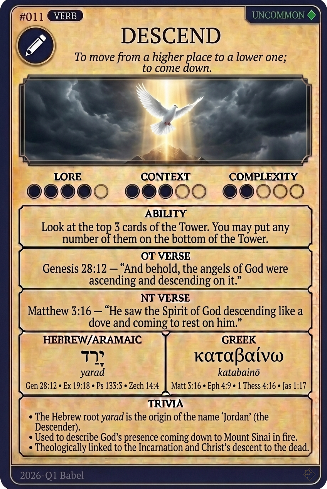

# Hypertext — DESCEND

## Word
**DESCEND** — To come down from a higher place to a lower

## Old Testament
> Genesis 11:5 — "And the LORD came down to see the city and the tower, which the children of men builded"

## New Testament
> John 3:13 — "no man hath ascended up to heaven, but he that came down from heaven"

## Trivia
- The builders say let us go up; the very next verse says the LORD came down - the tower meant to reach heaven still has to be stooped to.
- Genesis uses the same coming down before Sodom, where God says I will go down now, and see, as though judgment required an inspection first.
- Hebrew direction is fixed to the land rather than the compass, so one always goes down to Egypt and up to Jerusalem, however the road actually runs.

