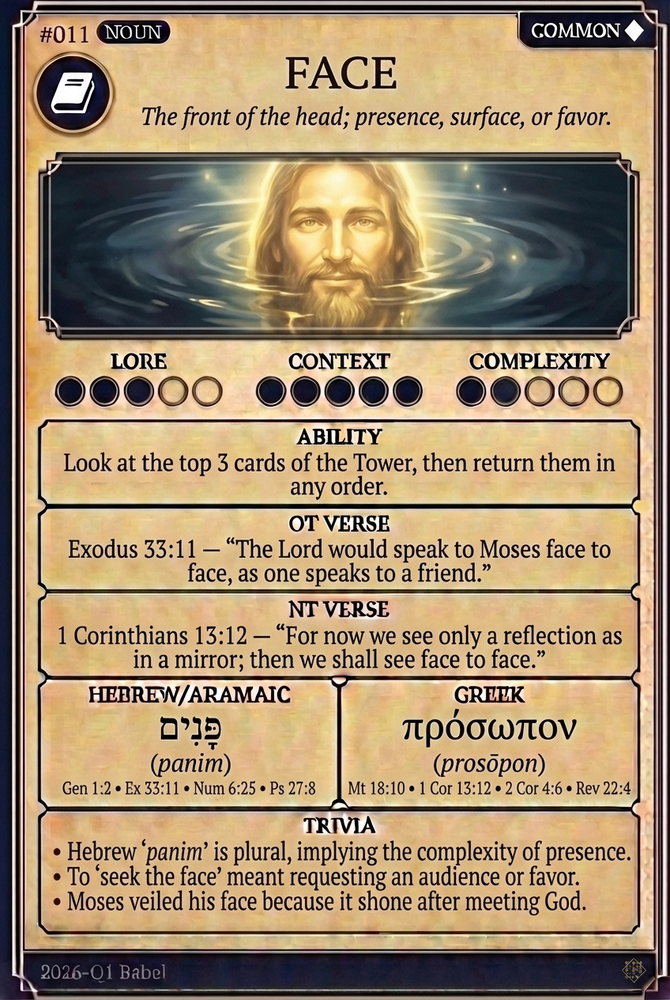

# Hypertext — FACE

## Word
**FACE** — The front of the head; presence, surface, or favor.

## Old Testament
> Exodus 33:11 — "The Lord would speak to Moses face to face, as one speaks to a friend."

## New Testament
> 1 Corinthians 13:12 — "For now we see only a reflection as in a mirror; then we shall see face to face."

## Trivia
- Hebrew 'panim' is plural, implying the complexity of presence.
- To 'seek the face' meant requesting an audience or favor.
- Moses veiled his face because it shone after meeting God.

