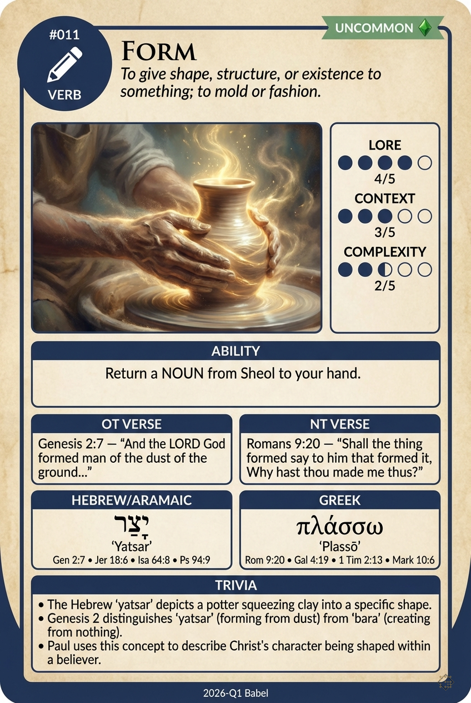

# Hypertext — FORM

## Word
**FORM** — To give shape, structure, or existence to something; to mold or fashion.

## Old Testament
> Genesis 2:7 — "And the LORD God formed man of the dust of the ground..."

## New Testament
> Romans 9:20 — "Shall the thing formed say to him that formed it, Why hast thou made me thus?"

## Trivia
- The Hebrew 'yatsar' depicts a potter squeezing clay into a specific shape.
- Genesis 2 distinguishes 'yatsar' (forming from dust) from 'bara' (creating from nothing).
- Paul uses this concept to describe Christ's character being shaped within a believer.

