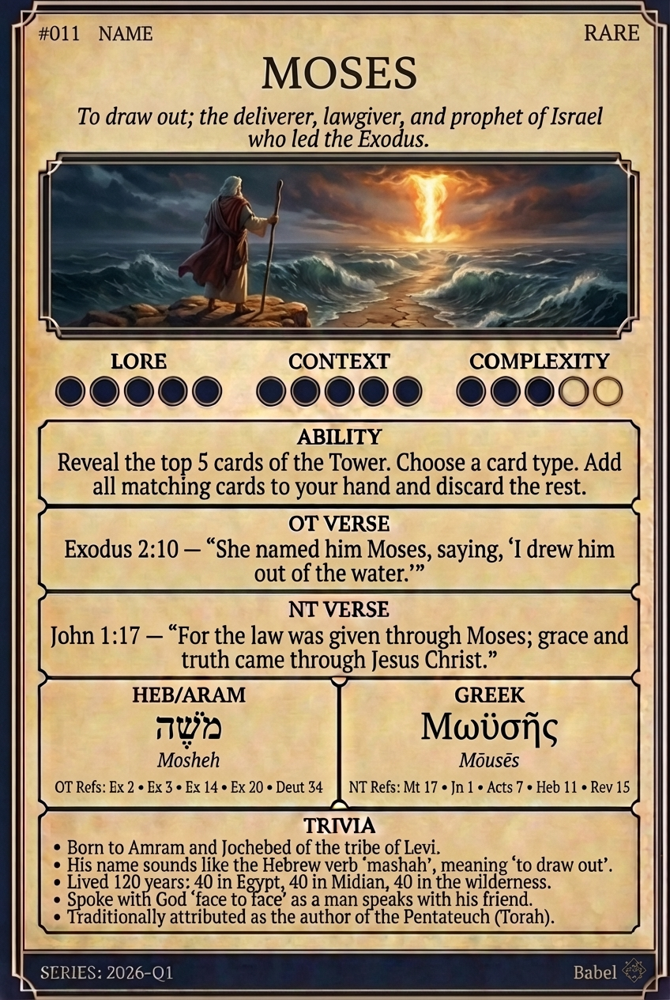

# Hypertext — MOSES

## Word
**MOSES** — The deliverer of Israel who drew his people out of Egypt and received the Law.

## Old Testament
> Exodus 2:10 — "She named him Moses, saying, 'I drew him out of the water.'"

## New Testament
> John 1:17 — "For the law was given through Moses; grace and truth came through Jesus Christ."

## Trivia
- Born in Egypt, hidden in a basket, and raised by Pharaoh's daughter.
- Traditionally credited as the author of the Torah (the first five books).
- Spoke with God face-to-face; his face shone so brightly he wore a veil.
- His name sounds like the Hebrew 'mashah', meaning 'to draw out'.
- Lived 120 years: 40 in Egypt, 40 in Midian, 40 in the wilderness.

