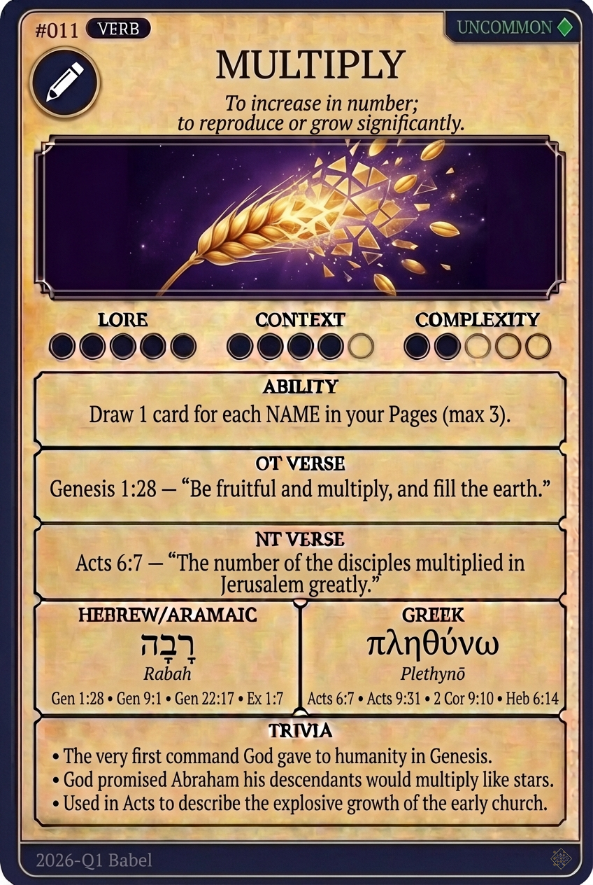

# Hypertext — MULTIPLY

## Word
**MULTIPLY** — To increase in number; to reproduce or grow significantly.

## Old Testament
> Genesis 1:28 — "Be fruitful and multiply, and fill the earth."

## New Testament
> Acts 6:7 — "The number of the disciples multiplied in Jerusalem greatly."

## Trivia
- The very first command God gave to humanity in Genesis.
- God promised Abraham his descendants would multiply like stars.
- Used in Acts to describe the explosive growth of the early church.

