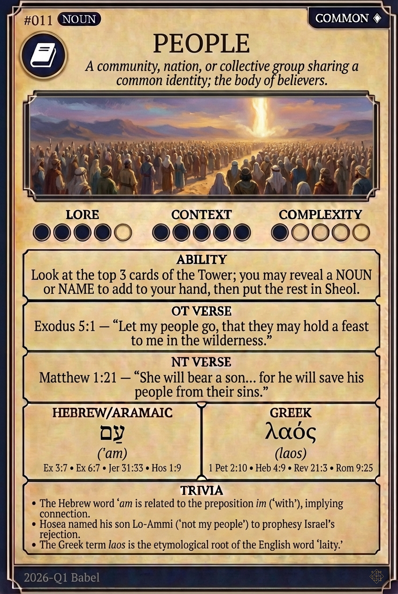

# Hypertext — PEOPLE

## Word
**PEOPLE** — A community, nation, or collective group sharing a common identity; the body of believers.

## Old Testament
> Exodus 5:1 — "Let my people go, that they may hold a feast to me in the wilderness."

## New Testament
> Matthew 1:21 — "She will bear a son... for he will save his people from their sins."

## Trivia
- The Hebrew word 'am is related to the preposition im ('with'), implying connection.
- Hosea named his son Lo-Ammi ('not my people') to prophesy Israel's rejection.
- The Greek term laos is the etymological root of the English word 'laity.'

