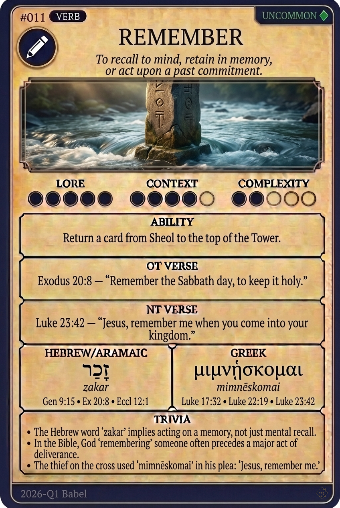

# Hypertext — REMEMBER

## Word
**REMEMBER** — To recall to mind, retain in memory, or act upon a past commitment.

## Old Testament
> Exodus 20:8 — "Remember the Sabbath day, to keep it holy."

## New Testament
> Luke 23:42 — "Jesus, remember me when you come into your kingdom."

## Trivia
- The Hebrew word 'zakar' implies acting on a memory, not just mental recall.
- In the Bible, God 'remembering' someone often precedes a major act of deliverance.
- The thief on the cross used 'mimnēskomai' in his plea: 'Jesus, remember me.'

