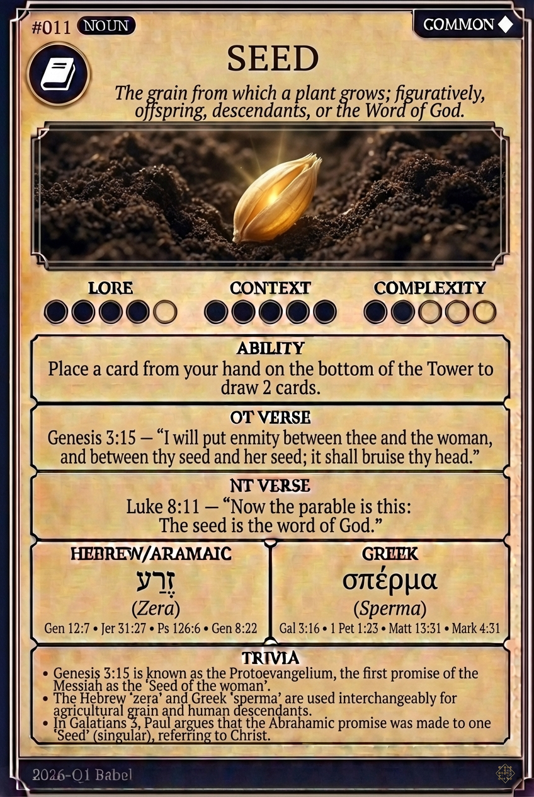

# Hypertext — SEED

## Word
**SEED** — The grain from which a plant grows; figuratively, offspring, descendants, or the Word of God.

## Old Testament
> Genesis 3:15 — "I will put enmity between thee and the woman, and between thy seed and her seed; it shall bruise thy head."

## New Testament
> Luke 8:11 — "Now the parable is this: The seed is the word of God."

## Trivia
- Genesis 3:15 is known as the Protoevangelium, the first promise of the Messiah as the 'Seed of the woman'.
- The Hebrew 'zera' and Greek 'sperma' are used interchangeably for agricultural grain and human descendants.
- In Galatians 3, Paul argues that the Abrahamic promise was made to one 'Seed' (singular), referring to Christ.

