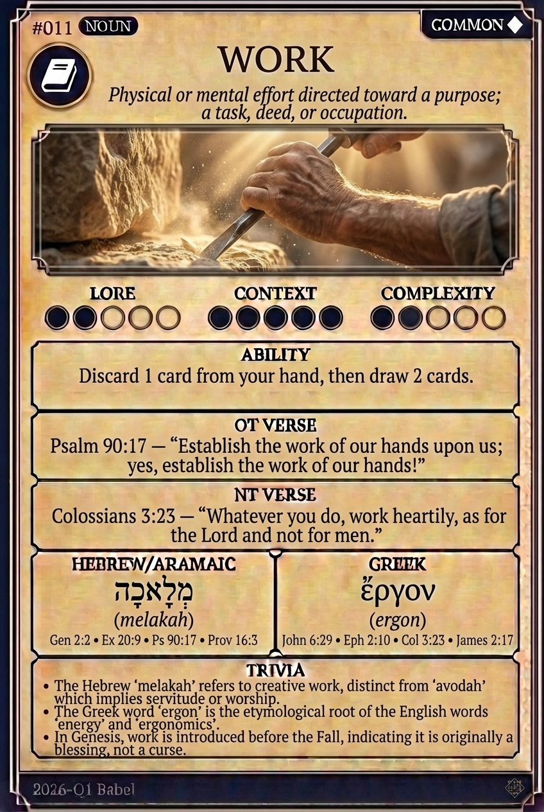

# Hypertext — WORK

## Word
**WORK** — Physical or mental effort directed toward a purpose; a task, deed, or occupation.

## Old Testament
> Psalm 90:17 — "Establish the work of our hands upon us; yes, establish the work of our hands!"

## New Testament
> Colossians 3:23 — "Whatever you do, work heartily, as for the Lord and not for men."

## Trivia
- The Hebrew 'melakah' refers to creative work, distinct from 'avodah' which implies servitude or worship.
- The Greek word 'ergon' is the etymological root of the English words 'energy' and 'ergonomics'.
- In Genesis, work is introduced before the Fall, indicating it is originally a blessing, not a curse.

