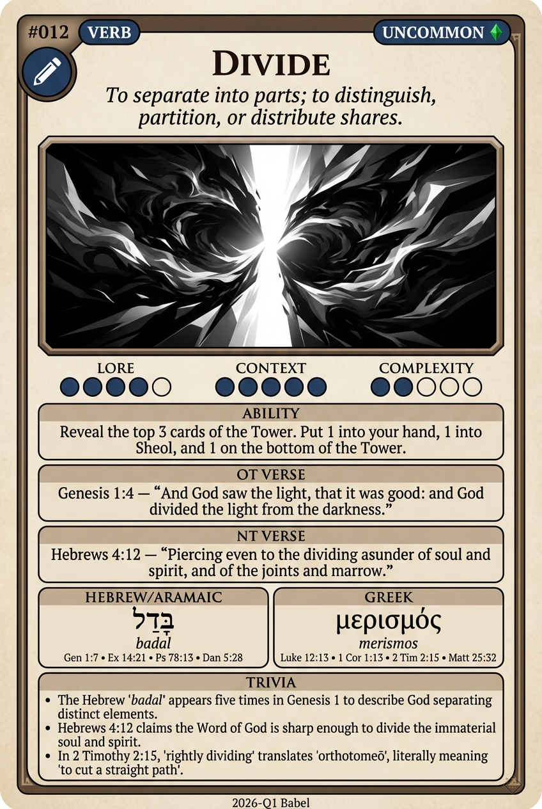

# Hypertext — DIVIDE

## Word
**DIVIDE** — To separate into parts; to distinguish, partition, or distribute shares.

## Old Testament
> Genesis 1:4 — "And God saw the light, that it was good: and God divided the light from the darkness."

## New Testament
> Hebrews 4:12 — "Piercing even to the dividing asunder of soul and spirit, and of the joints and marrow."

## Trivia
- The Hebrew 'badal' appears five times in Genesis 1 to describe God separating distinct elements.
- Hebrews 4:12 claims the Word of God is sharp enough to divide the immaterial soul and spirit.
- In 2 Timothy 2:15, 'rightly dividing' translates 'orthotomeō', literally meaning 'to cut a straight path'.

