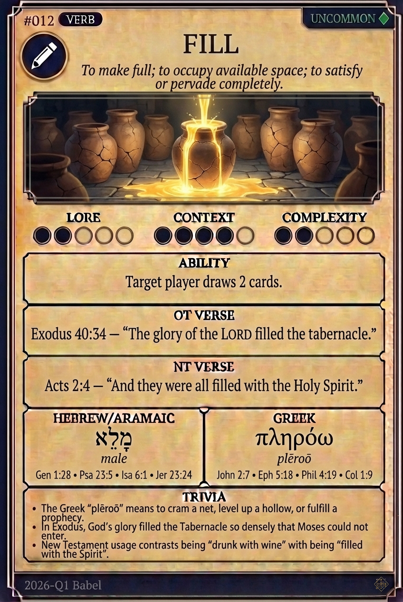

# Hypertext — FILL

## Word
**FILL** — To make full; to occupy available space; to satisfy or pervade completely.

## Old Testament
> Exodus 40:34 — "The glory of the LORD filled the tabernacle."

## New Testament
> Acts 2:4 — "And they were all filled with the Holy Spirit."

## Trivia
- The Greek 'plēroō' means to cram a net, level up a hollow, or fulfill a prophecy.
- In Exodus, God's glory filled the Tabernacle so densely that Moses could not enter.
- New Testament usage contrasts being 'drunk with wine' with being 'filled with the Spirit'.

