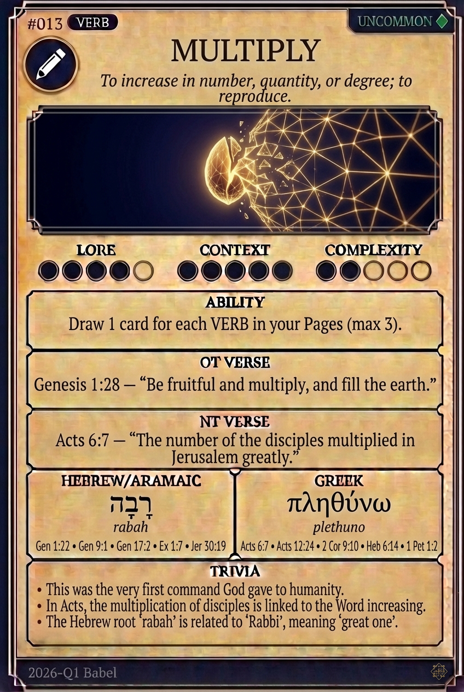

# Hypertext — MULTIPLY

## Word
**MULTIPLY** — To increase in number, quantity, or degree; to reproduce.

## Old Testament
> Genesis 1:28 — "Be fruitful and multiply, and fill the earth."

## New Testament
> Acts 6:7 — "The number of the disciples multiplied in Jerusalem greatly."

## Trivia
- This was the very first command God gave to humanity.
- In Acts, the multiplication of disciples is linked to the Word increasing.
- The Hebrew root 'rabah' is related to 'Rabbi', meaning 'great one'.

