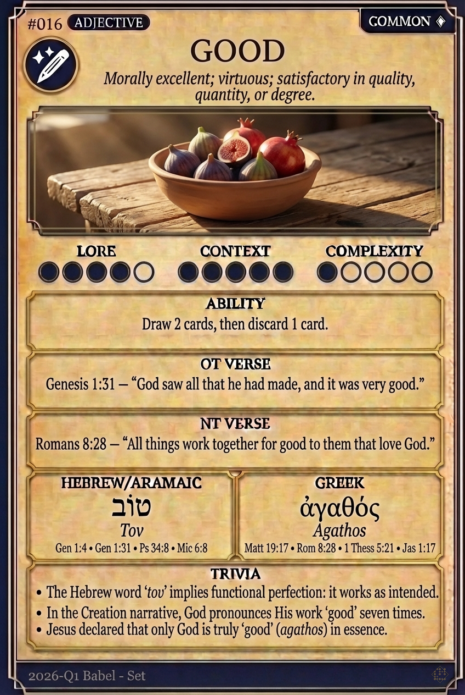

# Hypertext — GOOD

## Word
**GOOD** — Morally excellent; virtuous; satisfactory in quality, quantity, or degree.

## Old Testament
> Genesis 1:31 — "God saw all that he had made, and it was very good."

## New Testament
> Romans 8:28 — "All things work together for good to them that love God."

## Trivia
- The Hebrew word 'tov' implies functional perfection: it works as intended.
- In the Creation narrative, God pronounces His work 'good' seven times.
- Jesus declared that only God is truly 'good' (agathos) in essence.

