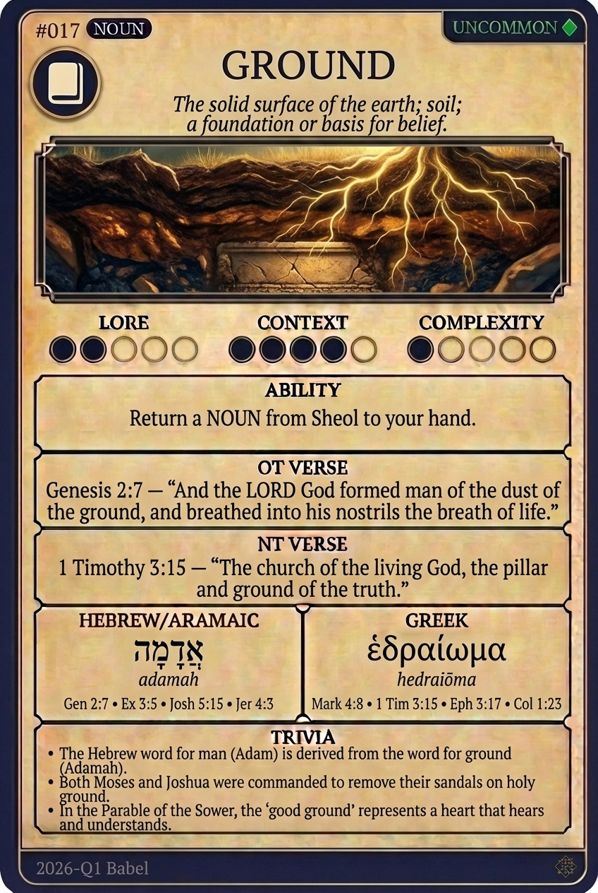

# Hypertext — GROUND

## Word
**GROUND** — The solid surface of the earth; soil; a foundation or basis for belief.

## Old Testament
> Genesis 2:7 — "And the LORD God formed man of the dust of the ground, and breathed into his nostrils the breath of life."

## New Testament
> 1 Timothy 3:15 — "The church of the living God, the pillar and ground of the truth."

## Trivia
- The Hebrew word for man (Adam) is derived from the word for ground (Adamah).
- Both Moses and Joshua were commanded to remove their sandals on holy ground.
- In the Parable of the Sower, the 'good ground' represents a heart that hears and understands.

