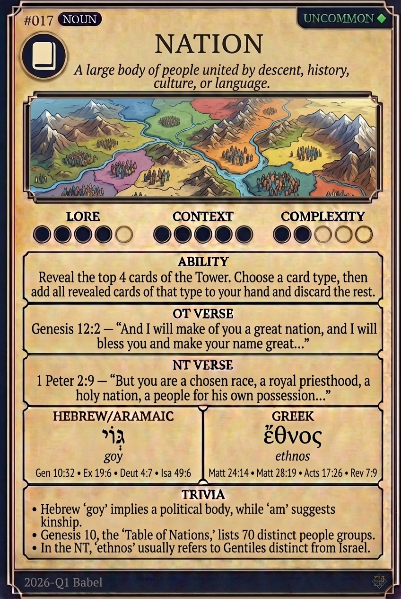

# Hypertext — NATION

## Word
**NATION** — A large body of people united by descent, history, culture, or language.

## Old Testament
> Genesis 12:2 — "And I will make of you a great nation, and I will bless you and make your name great..."

## New Testament
> 1 Peter 2:9 — "But you are a chosen race, a royal priesthood, a holy nation, a people for his own possession..."

## Trivia
- Hebrew 'goy' implies a political body, while 'am' suggests kinship.
- Genesis 10, the 'Table of Nations,' lists 70 distinct people groups.
- In the NT, 'ethnos' usually refers to Gentiles distinct from Israel.

