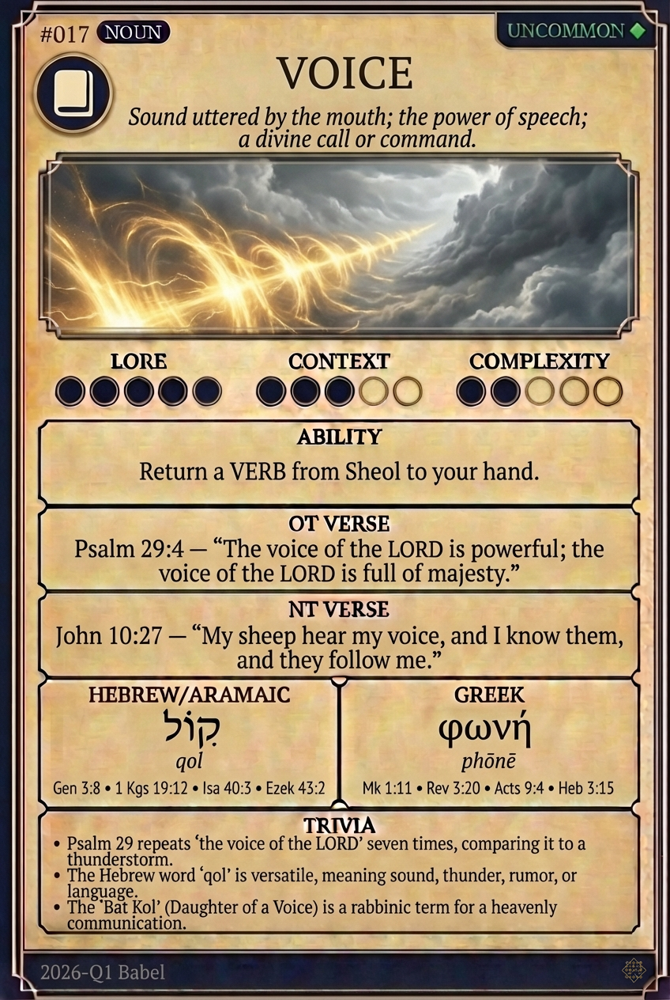

# Hypertext — VOICE

## Word
**VOICE** — Sound uttered by the mouth; the power of speech; a divine call or command.

## Old Testament
> Psalm 29:4 — "The voice of the LORD is powerful; the voice of the LORD is full of majesty."

## New Testament
> John 10:27 — "My sheep hear my voice, and I know them, and they follow me."

## Trivia
- Psalm 29 repeats 'the voice of the LORD' seven times, comparing it to a thunderstorm.
- The Hebrew word 'qol' is versatile, meaning sound, thunder, rumor, or language.
- The 'Bat Kol' (Daughter of a Voice) is a rabbinic term for a heavenly communication.

