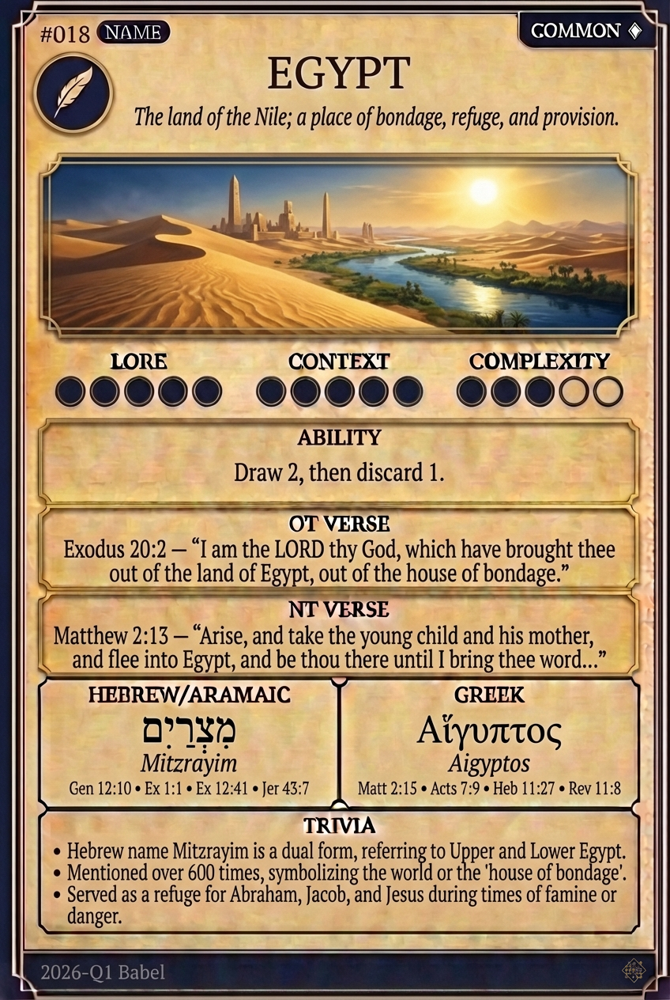

# Hypertext — EGYPT

## Word
**EGYPT** — The land of the Nile; a place of bondage, refuge, and provision.

## Old Testament
> Exodus 20:2 — "I am the LORD thy God, which have brought thee out of the land of Egypt, out of the house of bondage."

## New Testament
> Matthew 2:13 — "Arise, and take the young child and his mother, and flee into Egypt, and be thou there until I bring thee word..."

## Trivia
- Hebrew name Mitzrayim is a dual form, referring to Upper and Lower Egypt.
- Mentioned over 600 times, symbolizing the world or the 'house of bondage'.
- Served as a refuge for Abraham, Jacob, and Jesus during times of famine or danger.

