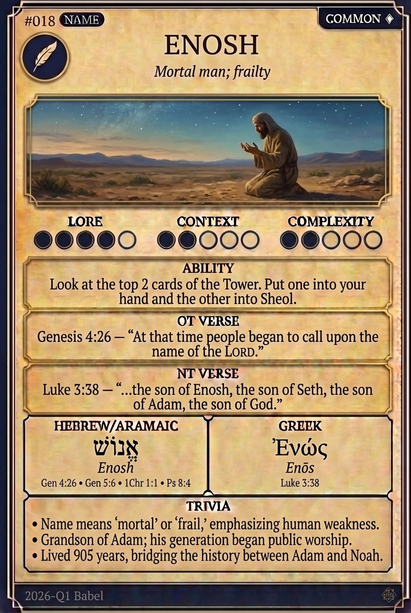

# Hypertext — ENOSH

## Word
**ENOSH** — Mortal man; frailty

## Old Testament
> Genesis 4:26 — "At that time people began to call upon the name of the LORD."

## New Testament
> Luke 3:38 — "...the son of Enosh, the son of Seth, the son of Adam, the son of God."

## Trivia
- Name means 'mortal' or 'frail,' emphasizing human weakness.
- Grandson of Adam; his generation began public worship.
- Lived 905 years, bridging the history between Adam and Noah.

