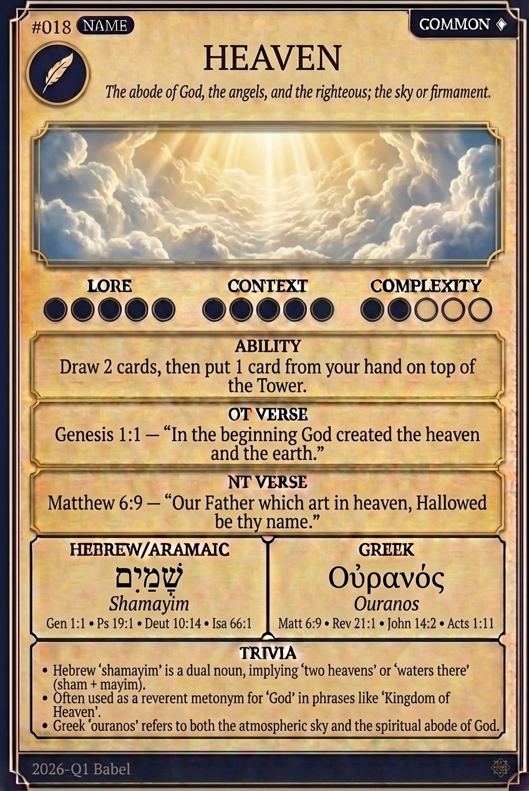

# Hypertext — HEAVEN

## Word
**HEAVEN** — The abode of God, the angels, and the righteous; the sky or firmament.

## Old Testament
> Genesis 1:1 — "In the beginning God created the heaven and the earth."

## New Testament
> Matthew 6:9 — "Our Father which art in heaven, Hallowed be thy name."

## Trivia
- Hebrew 'shamayim' is a dual noun, implying 'two heavens' or 'waters there' (sham + mayim).
- Often used as a reverent metonym for 'God' in phrases like 'Kingdom of Heaven'.
- Greek 'ouranos' refers to both the atmospheric sky and the spiritual abode of God.

