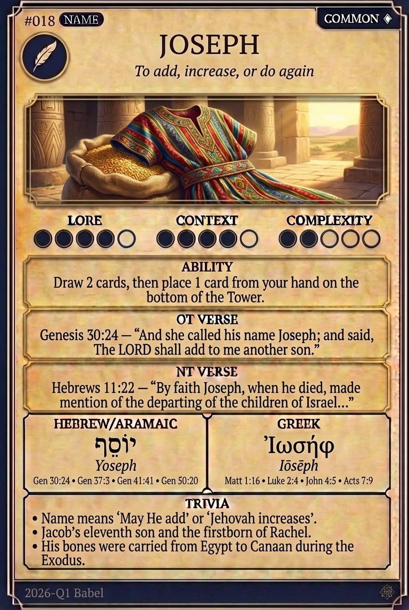

# Hypertext — JOSEPH

## Word
**JOSEPH** — To add, increase, or do again

## Old Testament
> Genesis 30:24 — "And she called his name Joseph; and said, The LORD shall add to me another son."

## New Testament
> Hebrews 11:22 — "By faith Joseph, when he died, made mention of the departing of the children of Israel..."

## Trivia
- Name means 'May He add' or 'Jehovah increases'.
- Jacob’s eleventh son and the firstborn of Rachel.
- His bones were carried from Egypt to Canaan during the Exodus.

