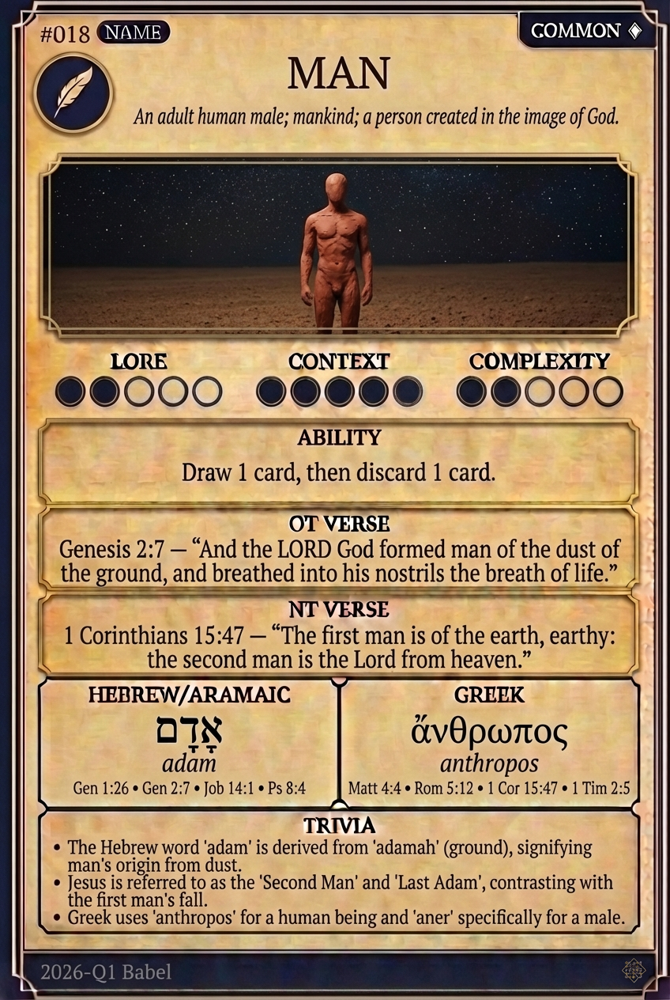

# Hypertext — MAN

## Word
**MAN** — An adult human male; mankind; a person created in the image of God.

## Old Testament
> Genesis 2:7 — "And the LORD God formed man of the dust of the ground, and breathed into his nostrils the breath of life."

## New Testament
> 1 Corinthians 15:47 — "The first man is of the earth, earthy: the second man is the Lord from heaven."

## Trivia
- The Hebrew word 'adam' is derived from 'adamah' (ground), signifying man's origin from dust.
- Jesus is referred to as the 'Second Man' and 'Last Adam', contrasting with the first man's fall.
- Greek uses 'anthropos' for a human being and 'aner' specifically for a male.

