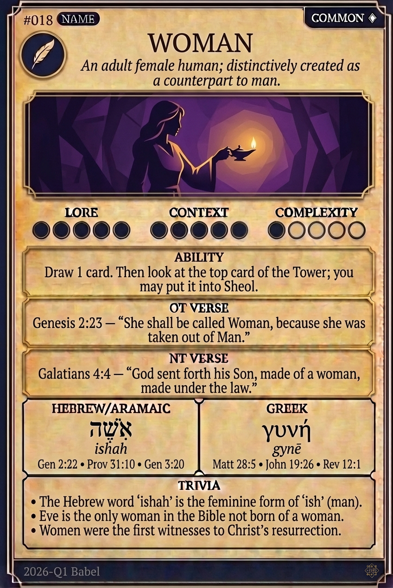

# Hypertext — WOMAN

## Word
**WOMAN** — An adult female human; distinctively created as a counterpart to man.

## Old Testament
> Genesis 2:23 — "She shall be called Woman, because she was taken out of Man."

## New Testament
> Galatians 4:4 — "God sent forth his Son, made of a woman, made under the law."

## Trivia
- The Hebrew word 'ishah' is the feminine form of 'ish' (man).
- Eve is the only woman in the Bible not born of a woman.
- Women were the first witnesses to Christ's resurrection.

