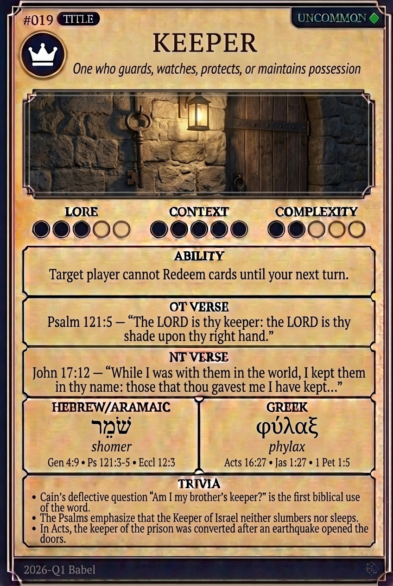

# Hypertext — KEEPER

## Word
**KEEPER** — One who guards, watches, protects, or maintains possession

## Old Testament
> Psalm 121:5 — "The LORD is thy keeper: the LORD is thy shade upon thy right hand."

## New Testament
> John 17:12 — "While I was with them in the world, I kept them in thy name: those that thou gavest me I have kept..."

## Trivia
- Cain's deflective question 'Am I my brother's keeper?' is the first biblical use of the word.
- The Psalms emphasize that the Keeper of Israel neither slumbers nor sleeps.
- In Acts, the keeper of the prison was converted after an earthquake opened the doors.

