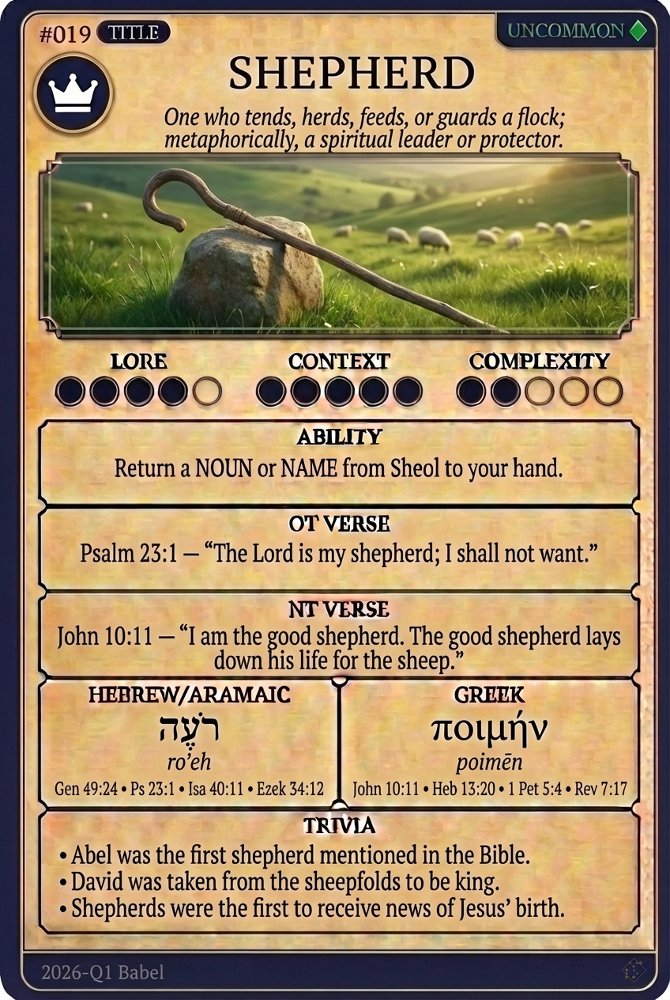

# Hypertext — SHEPHERD

## Word
**SHEPHERD** — One who tends, herds, feeds, or guards a flock; metaphorically, a spiritual leader or protector.

## Old Testament
> Psalm 23:1 — "The Lord is my shepherd; I shall not want."

## New Testament
> John 10:11 — "I am the good shepherd. The good shepherd lays down his life for the sheep."

## Trivia
- Abel was the first shepherd mentioned in the Bible.
- David was taken from the sheepfolds to be king.
- Shepherds were the first to receive news of Jesus' birth.

