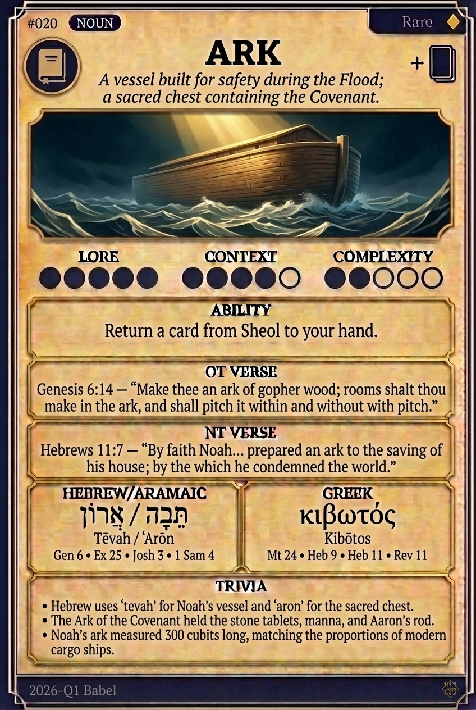

# Hypertext — ARK

## Word
**ARK** — A vessel built for safety during the Flood; a sacred chest containing the Covenant.

## Old Testament
> Genesis 6:14 — "Make thee an ark of gopher wood; rooms shalt thou make in the ark, and shall pitch it within and without with pitch."

## New Testament
> Hebrews 11:7 — "By faith Noah... prepared an ark to the saving of his house; by the which he condemned the world."

## Trivia
- Hebrew uses 'tevah' for Noah's vessel and 'aron' for the sacred chest.
- The Ark of the Covenant held the stone tablets, manna, and Aaron's rod.
- Noah's ark measured 300 cubits long, matching the proportions of modern cargo ships.

