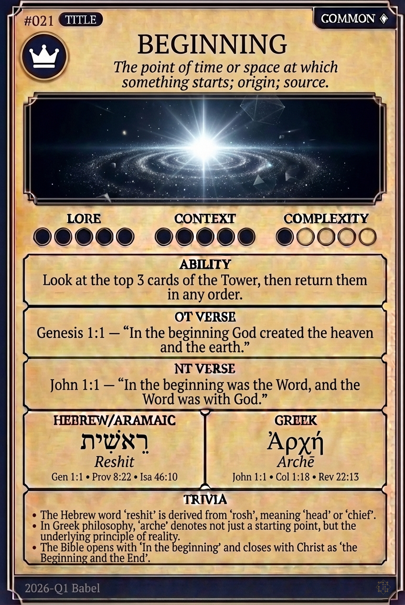

# Hypertext — BEGINNING

## Word
**BEGINNING** — The point of time or space at which something starts; origin; source.

## Old Testament
> Genesis 1:1 — "In the beginning God created the heaven and the earth."

## New Testament
> John 1:1 — "In the beginning was the Word, and the Word was with God."

## Trivia
- The Hebrew word 'reshit' is derived from 'rosh', meaning 'head' or 'chief'.
- In Greek philosophy, 'arche' denotes not just a starting point, but the underlying principle of reality.
- The Bible opens with 'In the beginning' and closes with Christ as 'the Beginning and the End'.

